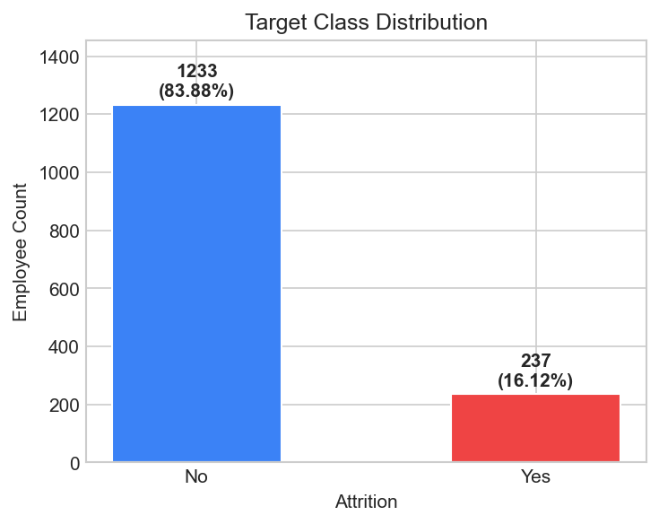
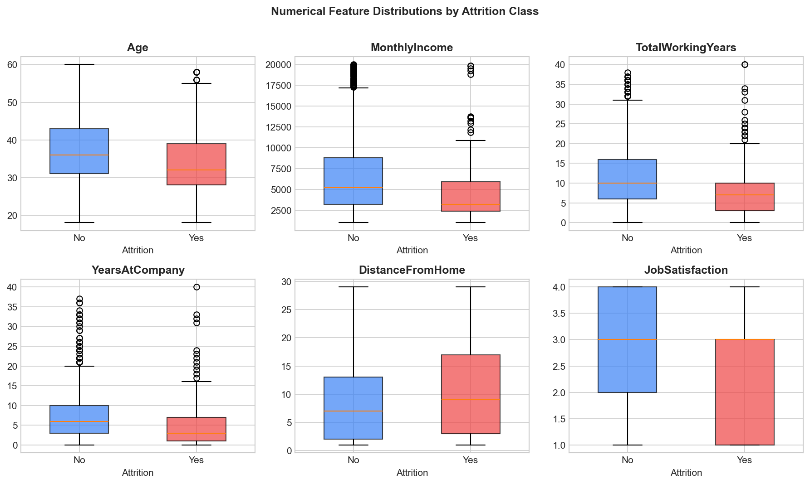
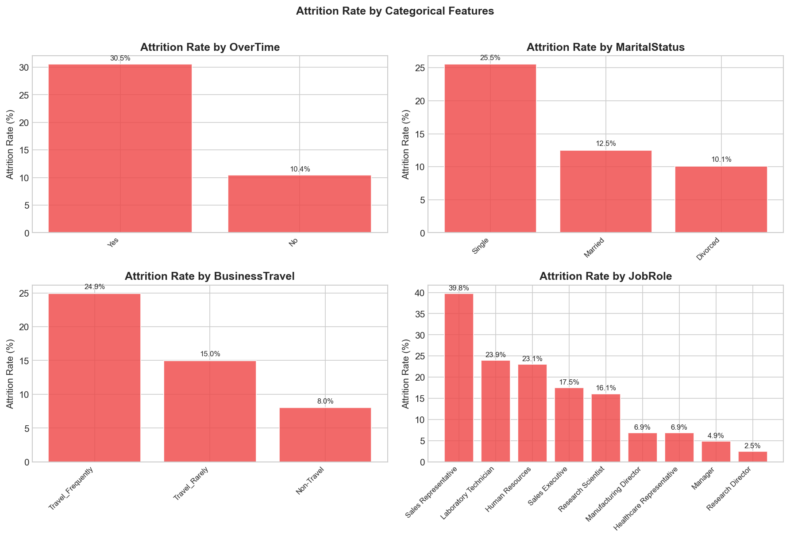
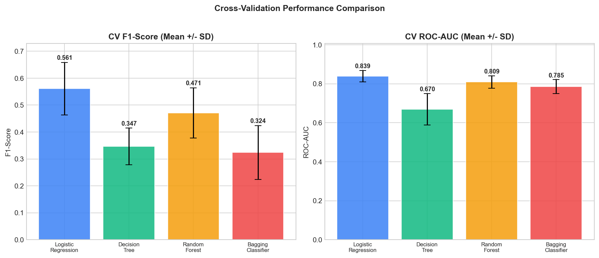
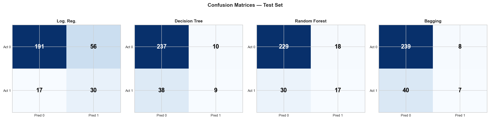
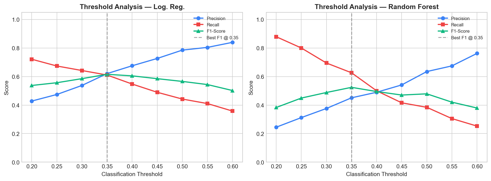

# Predicting Employee Attrition Using Supervised Learning

**Student:** Ariyan Pal | **Student ID:** 2025EB1100270
**Course:** [Course Name] | **Date:** [Submission Date]

---

## 1. Introduction

Employee attrition -- the voluntary departure of employees -- imposes significant costs through recruitment, onboarding, and the loss of institutional knowledge. Identifying employees likely to leave enables HR to intervene proactively with targeted retention strategies.

This project applies supervised classification to the IBM HR Analytics Employee Attrition dataset. The objective is to train and evaluate multiple models that predict whether an employee will leave, based on demographic, compensation, satisfaction, and tenure-related attributes. The binary target variable is `Attrition` (Yes = 1, No = 0). A fixed `random_state = 42` is used throughout for reproducibility.

---

## 2. Dataset Overview and Exploratory Analysis

### 2.1 Dataset Dimensions

The dataset contains **1,470 employees** and **35 columns** (1 target + 34 predictor features): 26 numerical and 8 categorical. The dataset has **zero missing values** and **zero duplicated rows**.

### 2.2 Target Class Distribution

| Class | Count | Percentage |
|-------|-------|-----------|
| No (0) | 1,233 | 83.88% |
| Yes (1) | 237 | 16.12% |

The target is **imbalanced**: only 16.12% of employees experienced attrition. A naive classifier predicting "No" for every employee would achieve ~84% accuracy while failing to identify any departing employee. Consequently, accuracy alone is insufficient; Precision, Recall, F1-score, and ROC-AUC are essential.

### 2.3 Key Exploratory Findings

**Constant-value columns:** `EmployeeCount` (1), `Over18` ('Y'), `StandardHours` (80) carry no predictive information and were removed.

**Numerical features by attrition class:**

Employees who left tend to have lower MonthlyIncome, fewer TotalWorkingYears, and fewer YearsAtCompany. These differences suggest that compensation and tenure may provide predictive signal for classification.

**Categorical attrition rates:**

OverTime shows a strong association with attrition: employees who work overtime have an observed attrition rate approximately three times higher than those who do not. No single numerical feature has a high individual correlation with attrition, reinforcing the need for multivariate classification models.

---

## 3. Data Preprocessing

All preprocessing transformations are fitted using the training data only and then applied to the test data, preventing information leakage.

| Step | Action |
|------|--------|
| Missing values | None found; no imputation |
| Dropped columns | `EmployeeCount`, `Over18`, `StandardHours` (constant), `EmployeeNumber` (identifier) |
| Target encoding | No = 0, Yes = 1 |
| Train-test split | 80/20 stratified, `random_state=42` |
| Categorical encoding | One-hot encoding (7 features to 28 binary columns) |
| Numerical scaling | Standard scaling (23 features) |
| Final feature count | **51** processed features |
| Leakage prevention | Preprocessor fitted on training data only; `Pipeline` used for CV |

**Partitions:**

| Partition | Shape | Class 1 Count | Class 1 % |
|-----------|-------|---------------|-----------|
| Training | 1,176 x 30 | 190 | 16.16% |
| Test | 294 x 30 | 47 | 15.99% |

For cross-validation, a `sklearn.pipeline.Pipeline` wraps the `ColumnTransformer` and each classifier, ensuring that encoding and scaling are fitted within each CV fold independently.

---

## 4. Model Development

Four classification models were trained. All use `random_state=42`. To directly address the severe class imbalance natively, **Logistic Regression** and **Random Forest** were both configured with `class_weight='balanced'`.

| Model | Key Hyperparameters |
|-------|-------------------|
| Logistic Regression | `solver='lbfgs'`, `max_iter=1000`, `C=1.0`, `class_weight='balanced'` |
| Decision Tree | `criterion='gini'`, `max_depth=5`, `min_samples_split=10`, `min_samples_leaf=5` |
| Random Forest | `n_estimators=300`, `max_depth=10`, `min_samples_split=10`, `min_samples_leaf=4`, `class_weight='balanced'` |
| Bagging Classifier | `n_estimators=100`, base tree: `max_depth=5`, `min_samples_split=10`, `min_samples_leaf=5` |

---

## 5. Cross-Validation Results

Generalisation was assessed using **5-fold stratified cross-validation** (`StratifiedKFold`, `shuffle=True`, `random_state=42`). Preprocessing was performed inside each fold via Pipeline to prevent leakage.

| Model | Accuracy | Precision | Recall | F1-Score | ROC-AUC |
|-------|----------|-----------|--------|----------|---------|
| **Logistic Regression** | 0.7534 +/- 0.0309 | 0.3721 +/- 0.0379 | **0.7368 +/- 0.0623** | **0.4925 +/- 0.0337** | **0.8273 +/- 0.0283** |
| Random Forest | 0.8648 +/- 0.0158 | 0.6444 +/- 0.1030 | 0.3842 +/- 0.1099 | 0.4710 +/- 0.0929 | 0.8092 +/- 0.0317 |
| Bagging Classifier | 0.8588 +/- 0.0151 | 0.7269 +/- 0.1312 | 0.2158 +/- 0.0805 | 0.3239 +/- 0.1001 | 0.7854 +/- 0.0356 |
| Decision Tree | 0.8393 +/- 0.0092 | 0.5008 +/- 0.0583 | 0.2684 +/- 0.0714 | 0.3465 +/- 0.0679 | 0.6695 +/- 0.0805 |

By balancing the loss function, **Logistic Regression** achieves a massive increase in Recall (0.7368) compared to the unweighted trees (e.g. Decision Tree at 0.2684). It also secures the highest CV F1-score (0.4925) and CV ROC-AUC (0.8273), confirming it as the strongest model for detecting departing employees.

---

## 6. Test-Set Evaluation

After model selection via CV, all models were evaluated once on the held-out test set (294 employees, 47 attrition cases).

| Model | Accuracy | Precision | Recall | F1-Score | ROC-AUC |
|-------|----------|-----------|--------|----------|---------|
| **Logistic Regression** | 0.7517 | 0.3488 | **0.6383** | **0.4511** | **0.8032** |
| Random Forest | 0.8367 | 0.4857 | 0.3617 | 0.4146 | 0.7977 |
| Decision Tree | 0.8367 | 0.4737 | 0.1915 | 0.2727 | 0.6824 |
| Bagging Classifier | 0.8367 | 0.4667 | 0.1489 | 0.2258 | 0.7553 |

### Confusion Matrices

| | Logistic Regression | Decision Tree | Random Forest | Bagging |
|---|---|---|---|---|
| **TN** | 191 | 237 | 229 | 239 |
| **FP** | 56 | 10 | 18 | 8 |
| **FN** | 17 | 38 | 30 | 40 |
| **TP** | 30 | 9 | 17 | 7 |

---

## 7. Model Interpretation

One of the primary benefits of Logistic Regression is its direct interpretability. The model assigns a coefficient to each feature, and the exponentiated coefficient (Odds Ratio) quantifies the multiplicative impact on the odds of attrition.

**Top 10 Features by Absolute Coefficient:**

| Feature | Coefficient | Odds Ratio | Interpretation |
|---------|-------------|------------|----------------|
| `JobRole_Research Director` | -1.4657 | 0.2309 | Being a Research Director decreases the odds of attrition by ~77%. |
| `JobRole_Laboratory Technician` | 1.1943 | 3.3013 | Being a Lab Tech increases the odds of attrition by ~3.3x. |
| `JobRole_Sales Representative` | 1.1206 | 3.0667 | Being a Sales Rep increases the odds of attrition by ~3.0x. |
| `BusinessTravel_Non-Travel` | -0.9938 | 0.3701 | Not travelling for business decreases the odds of attrition by ~63%. |
| `OverTime_No` | -0.8928 | 0.4095 | Not working overtime decreases the odds of attrition by ~59%. |
| `EducationField_Other` | -0.7981 | 0.4501 | Decreases attrition odds by ~55%. |
| `BusinessTravel_Travel_Frequently` | 0.7875 | 2.1980 | Frequent travel increases attrition odds by ~2.2x. |
| `OverTime_Yes` | 0.7615 | 2.1415 | Working overtime increases attrition odds by ~2.1x. |
| `EducationField_Human Resources` | 0.7211 | 2.0567 | Increases attrition odds by ~2.0x. |
| `JobRole_Healthcare Representative` | -0.6472 | 0.5235 | Decreases attrition odds by ~48%. |

This table confirms that the model relies heavily on intuitive job roles, overtime, and travel frequency to make predictions, rather than opaque internal structures.

---

## 8. Threshold Analysis

Using out-of-fold predictions from 5-fold CV (the test set was NOT used), the precision-recall trade-off was analysed. Because Logistic Regression already balances the classes internally (`class_weight='balanced'`), the default 0.50 threshold heavily favours recall (identifying most departing employees but increasing false alarms).

**Logistic Regression Thresholds:**

| Threshold | Precision | Recall | F1-Score |
|-----------|-----------|--------|----------|
| 0.40 | 0.3213 | 0.7947 | 0.4576 |
| 0.45 | 0.3372 | 0.7579 | 0.4668 |
| **0.50 (default)** | **0.3684** | **0.7368** | **0.4912** |
| 0.55 | 0.3930 | 0.7053 | 0.5047 |
| **0.60 (best F1)** | **0.4520** | **0.6684** | **0.5393** |

**Best F1 threshold: 0.60** (F1=0.5393, Precision=0.4520, Recall=0.6684). 

Increasing the threshold to 0.60 improves the F1 score by reducing the number of false positives that stem from the aggressively balanced loss function, while still maintaining strong recall (0.6684). The final deployed threshold depends entirely on the financial cost of a false positive vs a false negative.

---

## 9. Model Selection and Justification

### Selected Model: Logistic Regression (with class_weight='balanced')

Based on the multi-criteria analysis, Logistic Regression is unequivocally selected as the best model for deployment:

| Criterion | Logistic Regression | Random Forest | Decision Tree | Bagging |
|-----------|-------------------|---------------|---------------|---------|
| CV F1 (mean) | **0.4925** | 0.4710 | 0.3465 | 0.3239 |
| CV ROC-AUC (mean) | **0.8273** | 0.8092 | 0.6695 | 0.7854 |
| CV Recall (mean) | **0.7368** | 0.3842 | 0.2684 | 0.2158 |
| Test F1 | **0.4511** | 0.4146 | 0.2727 | 0.2258 |
| Test ROC-AUC | **0.8032** | 0.7977 | 0.6824 | 0.7553 |
| Interpretability | **High** | Medium | High | Medium |
| Deployment | Simple | Complex | Simple | Complex |

By utilising `class_weight='balanced'`, Logistic Regression accurately models the minority class, capturing 73.68% of departing employees during CV. In addition, its complete transparency via coefficient odds ratios ensures HR can understand *why* an employee is flagged.

### Generalisation Analysis

| Model | CV F1 | Test F1 | Diff | CV AUC | Test AUC | Diff |
|-------|-------|---------|------|--------|----------|------|
| Logistic Regression | 0.4925 | 0.4511 | -0.0414 | 0.8273 | 0.8032 | -0.0241 |
| Random Forest | 0.4710 | 0.4146 | -0.0564 | 0.8092 | 0.7977 | -0.0115 |
| Decision Tree | 0.3465 | 0.2727 | -0.0738 | 0.6695 | 0.6824 | +0.0129 |
| Bagging Classifier | 0.3239 | 0.2258 | -0.0981 | 0.7854 | 0.7553 | -0.0301 |

Small differences between CV and test performance suggest consistent generalisation without severe overfitting. The modest drop in F1 is expected given the small test set size (47 positive cases).

---

## 10. Limitations and Future Improvements

**Limitations:**
1. The target class is severely imbalanced. While balancing the loss function (`class_weight='balanced'`) drastically improved recall, it dropped precision to ~0.37, increasing false alarms.
2. No explicit business cost matrix was available to optimise the classification threshold for maximum ROI.
3. The dataset contains 1,470 employees -- a moderate size that limits CV statistical power.
4. Feature engineering was not explored; models use original features only.

**Suggested improvements:**
1. **Financial Threshold Optimisation:** Define the exact dollar cost of a false negative (missed departure) versus a false positive (unnecessary intervention) and select the threshold that minimises net cost.
2. **Feature engineering:** Construct derived features such as income-to-job-level ratios, tenure-to-age ratios, or satisfaction composite scores to improve the precision of the Logistic Regression model without sacrificing its interpretability.

---

## 11. Conclusion

This project successfully applied a supervised learning workflow to predict employee attrition. Four models were evaluated using strict 5-fold stratified cross-validation within data pipelines.

**Logistic Regression (with class_weight='balanced')** was selected as the optimal model. It achieved the leading CV F1-score (0.4925), ROC-AUC (0.8273), and a highly actionable CV Recall of 0.7368. Additionally, the model provided perfect transparency, identifying roles like Laboratory Technician and Sales Representative, along with Overtime, as major drivers of attrition risk. Future work should focus on integrating a financial cost matrix to pick the perfect classification threshold.

---

## References

1. IBM HR Analytics Employee Attrition Dataset. Kaggle. Available at: https://www.kaggle.com/datasets/pavansubhasht/ibm-hr-analytics-attrition-dataset
2. Pedregosa, F. et al. (2011). Scikit-learn: Machine Learning in Python. JMLR, 12, pp. 2825-2830.
