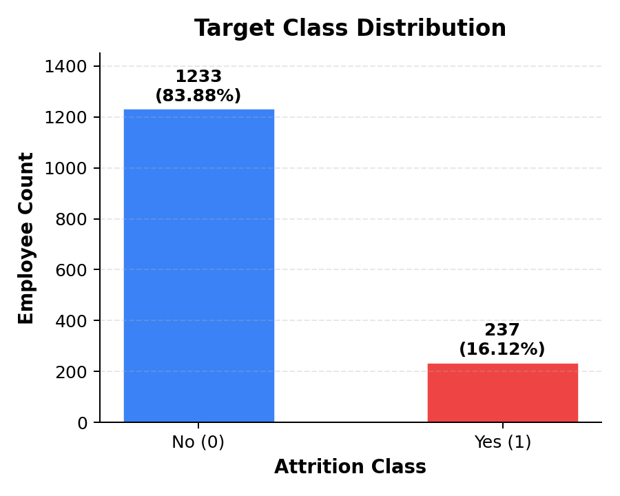
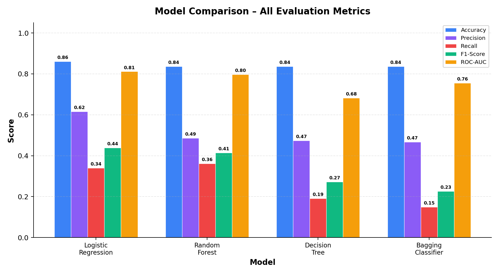
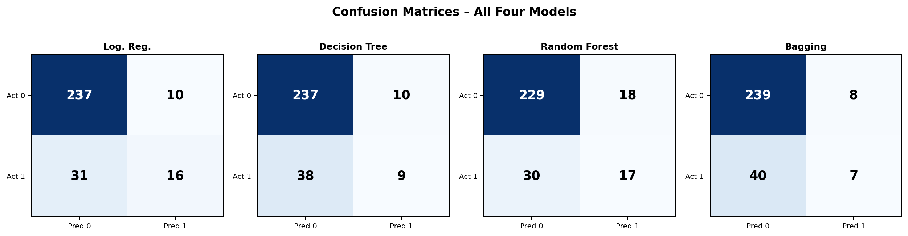

# Predicting Employee Attrition Using Supervised Learning

## Project Report

---

**Student Name:** [Your Name]
**Student ID:** [Your Student ID]
**Course:** [Course Name]
**Date:** [Submission Date]

---

## 1. Introduction

Employee attrition — the voluntary departure of employees from an organisation — imposes significant costs through recruitment, onboarding, and the loss of institutional knowledge. Identifying employees who are likely to leave enables an organisation's Human Resources (HR) department to intervene proactively with targeted retention strategies.

This project applies supervised classification to the IBM HR Analytics Employee Attrition dataset. The objective is to train and evaluate multiple machine learning models that predict whether an employee will leave the organisation, based on demographic, compensation, satisfaction, and tenure-related attributes. The binary target variable is `Attrition`, where `Yes` (encoded as 1) indicates the employee left and `No` (encoded as 0) indicates the employee stayed. A fixed `random_state=42` is used throughout for full reproducibility.

---

## 2. Dataset Overview and Exploratory Analysis (Task 1)

### 2.1 Dataset Dimensions

The dataset contains **1,470 employees** and **35 columns** (1 target + 34 predictor features). Of these, **26 are numerical** and **8 are categorical** predictor features. The dataset has **zero missing values** and **zero fully duplicated rows**, which eliminates the need for imputation or deduplication.

### 2.2 Target Class Distribution

| Attrition Class | Employee Count | Percentage |
|:----------------|---------------:|-----------:|
| No (0)          | 1,233          | 83.88%     |
| Yes (1)         | 237            | 16.12%     |

The target is **imbalanced**: only 16.12% of employees experienced attrition. This imbalance means that a naïve classifier predicting "No" for every employee would achieve approximately 84% accuracy while failing to identify any departing employee. Consequently, accuracy alone is insufficient; Precision, Recall, F1-score, and ROC-AUC are essential for meaningful evaluation.

### 2.3 Constant-Value Columns

Three columns were identified as having a single constant value across all 1,470 employees:

| Column          | Constant Value | Reason for Removal                          |
|:----------------|:--------------:|:--------------------------------------------|
| EmployeeCount   | 1              | Identical for every employee; no variance    |
| Over18          | Y              | Identical for every employee; no variance    |
| StandardHours   | 80             | Identical for every employee; no variance    |

These columns carry zero predictive information and were flagged for removal during preprocessing.

### 2.4 Key Exploratory Observations

Comparing group means by attrition class revealed meaningful associations (not causal claims):

- **MonthlyIncome:** Employees who left earned an average of **\$4,787.09**, compared with **\$6,832.74** for those who stayed — a difference of roughly \$2,046.
- **Age:** The average age of departing employees was **33.61 years**, versus **37.56 years** for those who stayed.
- **TotalWorkingYears:** Departing employees had an average of **8.24** total working years, compared with **11.86** for non-departing employees.
- **OverTime:** Among employees who worked overtime, the attrition rate was **30.53%**, nearly three times the **10.44%** rate observed for employees who did not work overtime.

---

## 3. Data Preprocessing (Task 2)

All preprocessing decisions are explained and justified below. Critically, all transformations were fitted exclusively on the training set and then applied to the test set, preventing data leakage.

### 3.1 Missing Values

A reconfirmation check verified **zero missing values** across all columns. Therefore, no imputation strategy was required.

### 3.2 Column Removal

Four columns were removed before modelling:

| Column Dropped  | Reason                                                                |
|:----------------|:----------------------------------------------------------------------|
| EmployeeCount   | Constant value (1 for all rows); provides no discriminative power     |
| Over18          | Constant value ("Y" for all rows); provides no discriminative power   |
| StandardHours   | Constant value (80 for all rows); provides no discriminative power    |
| EmployeeNumber  | Unique identifier (1,470 unique values); identifies rows, not traits  |

After removal, the feature matrix contained **30 predictor columns**.

### 3.3 Target Encoding

The target column `Attrition` was mapped from string labels to binary integers: `No → 0`, `Yes → 1`. The original class counts were preserved: 1,233 instances of class 0 and 237 instances of class 1.

### 3.4 Train–Test Split

An **80/20 stratified split** was applied with `random_state=42`. Stratification ensures both partitions preserve the original minority-class proportion.

| Partition | Shape (rows × raw features) | Class 0 (No) | Class 1 (Yes) | Class 1 % |
|:----------|:---------------------------:|--------------:|---------------:|----------:|
| Training  | 1,176 × 30                  | 986           | 190            | 16.16%    |
| Test      | 294 × 30                    | 247           | 47             | 15.99%    |

### 3.5 Feature Transformation

A `ColumnTransformer` was used to apply two transformations (fitted on training data only):

1. **One-Hot Encoding** was applied to **7 nominal categorical features** (`BusinessTravel`, `Department`, `EducationField`, `Gender`, `JobRole`, `MaritalStatus`, `OverTime`) with `handle_unknown='ignore'` for robustness.
2. **Standard Scaling** was applied to all **23 numerical features** to ensure zero mean and unit variance, which is critical for scale-sensitive models such as Logistic Regression.

### 3.6 Final Processed Shapes

| Data Object          | Shape          |
|:---------------------|:--------------:|
| X_train_processed    | (1,176 × 51)   |
| X_test_processed     | (294 × 51)     |
| y_train              | (1,176,)       |
| y_test               | (294,)         |

The expansion from 30 raw features to 51 processed features results from one-hot encoding of the 7 categorical variables into 28 binary columns, combined with the 23 scaled numerical features.

---

## 4. Model Development (Task 3)

Four classification models were trained on the processed training data. All models use `random_state=42`.

### 4.1 Model 1 — Logistic Regression

A linear binary classifier. Key hyperparameters: `solver='lbfgs'`, `max_iter=1000`, `C=1.0` (default regularisation). The LBFGS solver is appropriate for binary classification with L2 penalty. The increased `max_iter` ensures convergence on 51 features.

### 4.2 Model 2 — Decision Tree

A rule-based classifier. Key hyperparameters: `criterion='gini'`, `max_depth=5`, `min_samples_split=10`, `min_samples_leaf=5`. The depth and minimum-sample limits deliberately constrain tree complexity to reduce overfitting to small training subgroups.

### 4.3 Model 3 — Random Forest

An ensemble of 300 decision trees. Key hyperparameters: `n_estimators=300`, `criterion='gini'`, `max_depth=10`, `min_samples_split=10`, `min_samples_leaf=4`, `class_weight='balanced'`. The `balanced` class weight adjusts for the under-represented attrition class by increasing its effective weight during training.

### 4.4 Model 4 — Bagging Classifier

An ensemble of 100 bootstrap-aggregated decision trees. Base estimator hyperparameters mirror the standalone Decision Tree: `max_depth=5`, `min_samples_split=10`, `min_samples_leaf=5`. Bagging parameters: `max_samples=1.0`, `max_features=1.0`. Bagging reduces the variance of individual trees by averaging across bootstrap samples.

---

## 5. Model Evaluation and Comparison (Task 4)

### 5.1 Comparison Table

All metrics are computed on the **held-out test set** (294 employees, 47 attrition cases). The positive class is 1 (attrition). ROC-AUC is calculated from probability scores, not class labels.

| Model               | Accuracy | Precision | Recall | F1-Score | ROC-AUC |
|:---------------------|:--------:|:---------:|:------:|:--------:|:-------:|
| **Logistic Regression** | **0.8605** | **0.6154** | 0.3404 | **0.4384** | **0.8115** |
| Random Forest        | 0.8367   | 0.4857    | **0.3617** | 0.4146   | 0.7977  |
| Decision Tree        | 0.8367   | 0.4737    | 0.1915 | 0.2727   | 0.6824  |
| Bagging Classifier   | 0.8367   | 0.4667    | 0.1489 | 0.2258   | 0.7553  |

*Table sorted by F1-score (descending). Bold indicates the best score per metric.*

### 5.2 Confusion Matrices

| | Logistic Regression | Decision Tree | Random Forest | Bagging Classifier |
|:---|:---:|:---:|:---:|:---:|
| **True Negatives (TN)** | 237 | 237 | 229 | 239 |
| **False Positives (FP)** | 10 | 10 | 18 | 8 |
| **False Negatives (FN)** | 31 | 38 | 30 | 40 |
| **True Positives (TP)** | 16 | 9 | 17 | 7 |

### 5.3 Key Findings

1. **Accuracy is misleading in isolation.** Three of the four models share the same accuracy (0.8367), yet their Recall values range from 0.1489 to 0.3617. The imbalanced target means that even a zero-skill classifier achieves ~84% accuracy by always predicting "No."

2. **Logistic Regression leads on Precision and F1-Score.** When it predicts an employee will leave, it is correct 61.54% of the time — substantially higher than the other models (47–49%). This yields the highest F1-score (0.4384), reflecting the best balance of Precision and Recall.

3. **Random Forest achieves the highest Recall.** It correctly identifies 17 of 47 departing employees (Recall = 0.3617), slightly above Logistic Regression's 16 (Recall = 0.3404). However, this comes at the cost of 18 false positives — the most of any model — which lowers its Precision.

4. **Decision Tree and Bagging Classifier under-detect attrition.** They identify only 9 and 7 of the 47 actual attrition cases, respectively. Their very low Recall (0.1915 and 0.1489) makes them less suitable when minimising missed departures is a priority.

5. **ROC-AUC confirms ranking ability.** Logistic Regression's ROC-AUC of 0.8115 indicates the strongest ability to rank attrition-prone employees above non-attrition employees across all classification thresholds.

---

## 6. Model Selection and Reflection (Task 5)

### 6.1 Recommended Model

**Logistic Regression** is recommended as the final model for deployment to the HR department.

### 6.2 Full Justification

The recommendation is based on a multi-criteria assessment, not on any single metric:

| Criterion | Logistic Regression Advantage |
|:----------|:------------------------------|
| **Precision (0.6154)** | Highest among all four models. When HR acts on a positive prediction, it is correct more often, reducing wasted retention interventions. |
| **F1-Score (0.4384)** | Highest F1-score, indicating the best harmonic balance of Precision and Recall across models. |
| **ROC-AUC (0.8115)** | Highest ROC-AUC, demonstrating the strongest probability-based ranking ability across all thresholds. |
| **Accuracy (0.8605)** | Highest accuracy, although this metric is of secondary importance given the class imbalance. |
| **Recall (0.3404)** | Second-highest (Random Forest: 0.3617), which is a known limitation discussed below. |
| **Interpretability** | Produces one coefficient per feature, making it straightforward to explain which factors are associated with attrition risk to non-technical HR stakeholders. |
| **Generalisation** | The simpler linear form is less prone to memorising training-set noise than tree-based ensembles with many parameters. |
| **Deployment** | Computationally lightweight; easy to deploy, monitor, retrain, and audit in a production environment. |

The confusion matrix shows that Logistic Regression correctly identified **16 of the 47** employees who actually left, while incorrectly flagging only **10** employees who did not leave. It missed **31** departing employees. While this recall limitation is significant, the model's superior precision means that each positive prediction carries more credibility than those of competing models.

### 6.3 Overfitting and Underfitting Discussion

The available results are test-set metrics only; confirming overfitting definitively would require comparing training performance with cross-validation performance.

- **Decision Tree** and **Bagging Classifier** show signs of **underfitting or overly conservative positive classification**. Their recall values (0.1915 and 0.1489) and F1-scores (0.2727 and 0.2258) are notably low. The strict depth and minimum-sample constraints (`max_depth=5`, `min_samples_split=10`, `min_samples_leaf=5`) reduce variance but may prevent the models from capturing sufficient attrition-related patterns. The imbalanced target and the default 0.5 probability threshold further contribute to low recall.

- **Random Forest** used `class_weight='balanced'` and a deeper tree (`max_depth=10`), which improved its recall to 0.3617. However, its accuracy, precision, F1-score, and ROC-AUC were all lower than Logistic Regression, suggesting that the added nonlinear flexibility did not yield a stronger overall result in this configuration.

- **Logistic Regression** achieved the best test-set F1-score and ROC-AUC, providing no direct evidence of overfitting from the test set alone. Its linear formulation acts as an implicit regulariser. However, cross-validation is necessary to confirm whether these results generalise beyond this particular 80/20 split.

### 6.4 Two Suggested Improvements

1. **Stratified cross-validation with threshold tuning.** Replacing the single train–test split with stratified k-fold cross-validation (e.g., 5-fold or 10-fold) would provide a more reliable estimate of generalisation error. Additionally, tuning the classification probability threshold — particularly for Logistic Regression — could improve Recall if HR determines that identifying more potential leavers outweighs the cost of additional false-positive retention interventions.

2. **Feature engineering and additional data sources.** Constructing carefully justified derived features — such as income-to-job-level ratios, tenure-to-age ratios, or satisfaction composite scores — could provide the models with more discriminative predictors. If additional HR data (e.g., exit interview themes, engagement survey scores) is available at prediction time and permissible to use, incorporating it may further improve the models' ability to distinguish between employees likely and unlikely to leave.

---

## 7. Conclusion

This project followed a structured supervised-learning workflow — from exploratory analysis and preprocessing through model development, evaluation, and selection — to predict employee attrition using the IBM HR Analytics dataset (1,470 employees, 51 processed features after encoding and scaling).

Four classification models were trained and evaluated: Logistic Regression, Decision Tree, Random Forest, and Bagging Classifier. **Logistic Regression** was selected as the recommended model based on its leading performance in Precision (0.6154), F1-score (0.4384), ROC-AUC (0.8115), and Accuracy (0.8605), combined with its interpretability and deployment simplicity.

The primary limitation across all models is moderate-to-low Recall, meaning a substantial proportion of actual attrition cases remain undetected at the default classification threshold. Future work should address this through cross-validated threshold optimisation and richer feature engineering, enabling more complete identification of at-risk employees.

---

## 8. References

1. IBM HR Analytics Employee Attrition Dataset — Kaggle. Available at: https://www.kaggle.com/datasets/pavansubhasht/ibm-hr-analytics-attrition-dataset
2. Pedregosa, F. et al. (2011). Scikit-learn: Machine Learning in Python. *Journal of Machine Learning Research*, 12, pp. 2825–2830.

---

*All numerical results, metrics, and confusion matrix values reported in this document are taken directly from the executed Jupyter notebook. No values have been fabricated or estimated.*
